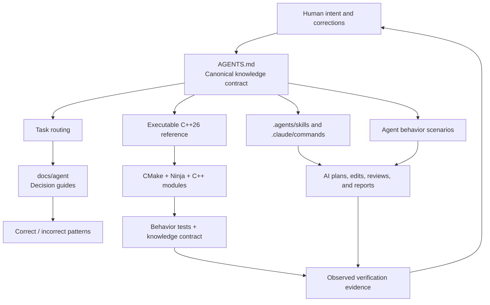

# AI for Modern C++

An executable knowledge base that teaches AI coding agents how to understand,
design, modify, verify, and review modern C++ repositories.

<p align="center"></p>

This repository combines five forms of knowledge:

1. **Rules** — stable, enforceable policy in `AGENTS.md`.
2. **Routing** — task-specific guides under `docs/agent/`.
3. **Patterns** — explicitly labeled correct and incorrect examples.
4. **Executable proof** — module-based C++26 source code that must build.
5. **Evals** — scenarios that test whether an AI agent applies the rules.

It is intentionally strict. The goal is not to collect isolated language
features or become an application product. The goal is to make high-quality
modern C++ engineering behavior legible and repeatable for AI agents.

## Knowledge Architecture



## How An Agent Uses The Repository

```text
Read AGENTS.md
    ↓
Classify the task
    ↓
Read the routed task guides
    ↓
Inspect code, tests, and the current diff
    ↓
Apply the smallest rule-compliant change
    ↓
Configure → build → test → review
    ↓
Report exact evidence
    ↓
Reflect durable human corrections back into the knowledge base
```

## Repository Map

```text
AGENTS.md                  Canonical policy and stable rule identifiers
CLAUDE.md                  Claude Code entry point
.agents/skills/            Codex-compatible repository workflows
.claude/commands/          Claude Code workflow adapters
docs/agent/                Task-specific engineering decision guides
docs/REVIEW.md             Rule-driven review checklist
docs/MCP.md                Safe tool and context policy
evals/                     Agent behavior scenarios and scoring rubric
src/                       Executable module-based proof of the rules
tests/                     Behavior tests and knowledge-contract checks
.github/workflows/ci.yml   macOS and Linux verification
CMakeLists.txt             CMake module and standard-library mode integration
```

Start with [`AGENTS.md`](AGENTS.md), then use the routing table in that file.
The detailed knowledge map is in
[`docs/agent/README.md`](docs/agent/README.md).

## Engineering Position

The reference implementation demonstrates and enforces:

- C++26 as the primary path, with modern C++20+ policy for derived work.
- C++ modules by default.
- `import std` when the effective toolchain supports it, with a
  global-module-fragment standard-header fallback that preserves `.cppm`
  project modules.
- Declaration in `.cppm` and non-trivial implementation in `.cpp`.
- Dotted lowercase module identities and matching namespaces.
- PascalCase enum-class enumerators and `m_`-prefixed private members.
- A consistent modern syntax contract for initialization, casts, nullability,
  control flow, readable return declarations, and const correctness.
- `std::print` and `std::println` for ordinary formatted console output rather
  than legacy iostream insertion chains.
- Concepts and compile-time contracts where they improve correctness.
- Explicit recoverable errors with `std::expected`.
- RAII ownership and isolated platform boundaries.
- Target-based CMake, Ninja, real builds, and honest test evidence.
- Qt Quick/QML as the primary interface for new user-facing interactive
  applications when the surface is unspecified, with C++ module-based domain
  behavior and an explicit presentation boundary.
- Product-specific UI/UX decisions instead of generic repetitive screen
  recipes, with QML and presentation assets grouped under a top-level `ui/`
  boundary.
- Optional CLI adapters for automation, tests, or headless use share the same
  application and domain modules rather than duplicating behavior.
- No fake success reports and no unrelated broad rewrites.

## Interaction Surface Default

An unspecified user-facing interactive application is not a request for a
CLI-only program. Its primary interface uses Qt 6, Qt Quick, QML, and Qt Quick
Controls. A request explicitly scoped to a CLI tool, service, library, daemon,
or headless process remains non-graphical.

A CLI may be added as a secondary adapter when it provides real automation,
testing, or headless value. The Qt Quick interface and CLI must call the same
C++ application and domain modules; neither adapter owns duplicated business
logic.

## Qt Quick UI Workflow

For a new Qt interface, invoke the repository workflow with a concrete product
goal:

```text
$source-command-design-qt-quick-ui

Create a MyApp interface with keyboard input, accessible focus, responsive
layout, explicit loading and error states, and domain logic in C++ modules.
```

The workflow requires a user-flow and visual-system pass before implementation,
including audience, information hierarchy, affordances, feedback, recovery,
content density, and a product-specific visual direction. It uses Qt Quick/QML
rather than Qt Widgets for new UI, keeps QML and visual assets under `ui/`, and
verifies the C++/QML boundary. See
[`docs/agent/QT_QUICK_UI.md`](docs/agent/QT_QUICK_UI.md).

The complete C++ syntax and identifier contract is documented in
[`docs/agent/SYNTAX_AND_STYLE.md`](docs/agent/SYNTAX_AND_STYLE.md).

## Build The Executable Proof

The active compiler, standard library, CMake version, generator, and standard
library module metadata determine whether `AUTO` selects `import std` or the
standard-header compatibility path. Project-owned C++ modules are mandatory in
both modes.

```bash
cmake -S . -B build -G Ninja -DCMAKE_BUILD_TYPE=Debug
cmake --build build --parallel
ctest --test-dir build --output-on-failure --no-tests=error
```

Expected configure evidence includes:

```text
AIMCPP_STDLIB_MODE=AUTO
AIMCPP_STDLIB_INTEGRATION=IMPORT_STD
AIMCPP_USE_IMPORT_STD=ON
```

On a toolchain without effective standard-library module support, expected
evidence is:

```text
AIMCPP_STDLIB_MODE=AUTO
AIMCPP_STDLIB_INTEGRATION=HEADERS
AIMCPP_USE_IMPORT_STD=OFF
```

That result changes only standard-library delivery. The build still compiles
the `.cppm` interface through `FILE_SET CXX_MODULES` and consumers still import
the project module. No project-owned `.h` or `.hpp` fallback is created.

The two source paths can be forced independently:

```bash
cmake -S . -B build/import-std -G Ninja -DAIMCPP_STDLIB_MODE=IMPORT_STD
cmake -S . -B build/headers -G Ninja -DAIMCPP_STDLIB_MODE=HEADERS
```

## Executable Reference Layout

```text
src/modern_cpp_agent/modern_cpp_agent.cppm   Exported declarations
src/modern_cpp_agent/modern_cpp_agent.cpp    Non-trivial implementation
src/main.cpp                                 Composition and usage example
tests/core_tests.cpp                         Public behavior verification
tests/knowledge_contract.cmake               Knowledge architecture regression test
```

The reference demonstrates `std::expected`, `std::optional`, `std::span`,
concepts, ranges, `constexpr`, `consteval`, `std::chrono`, `std::format`, and
`std::println` in both standard-library modes without turning the module
interface into an implementation dumping ground.

## Rule-Driven Review

Reviews cite stable identifiers rather than vague preferences:

```text
MOD-002: Exported declarations belong in .cppm.
ERR-001: Recoverable failures should use std::expected.
VER-003: Report exact commands and results.
```

Use [`docs/REVIEW.md`](docs/REVIEW.md) for the review contract and
[`evals/README.md`](evals/README.md) to evaluate agent behavior.

## Safe Tooling

The repository includes `.mcp.example.json` as a read-first starting point.
Local active configuration belongs in `.mcp.json` and must not contain committed
secrets. See [`docs/MCP.md`](docs/MCP.md).

## Portability Notes

- The preferred `import std` path is Clang 22+; GCC 15.x uses it only when the
  compiler, libstdc++, CMake, Ninja, and module metadata agree.
- Toolchains that support project C++ modules but not `import std` use minimal
  standard headers in global module fragments.
- Do not assume C compatibility globals are exported by `import std`.
- Avoid `std::views::enumerate` in portable examples until the active standard
  library is verified to provide it.

## Linux GCC Build

The verified GNU `import std` path is GCC 15.x, CMake 4.0+, Ninja 1.11+, and the
matching libstdc++ development package. CMake 3.31 does not support GCC
`import std`, but `AUTO` can retain project modules and select standard-library
headers.

On Ubuntu 25.10, install a repository-local pinned CMake without replacing the
system package:

```bash
sudo apt update
sudo apt install --yes g++ ninja-build python3-venv
bash scripts/bootstrap-linux-cmake.sh
.tools/cmake/bin/cmake -E remove_directory build/linux-gcc-debug
AIMCPP_STDLIB_MODE=IMPORT_STD bash scripts/verify-linux.sh
```

Fedora 43 also packages CMake 3.31, so use the same repository-local bootstrap:

```bash
sudo dnf install --assumeyes gcc-c++ ninja-build python3 python3-pip
bash scripts/bootstrap-linux-cmake.sh
.tools/cmake/bin/cmake -E remove_directory build/linux-gcc-debug
AIMCPP_STDLIB_MODE=IMPORT_STD bash scripts/verify-linux.sh
```

The configure step validates every `libstdc++.modules.json` source. Broken
distribution-relative paths are repaired into generated metadata under the
build directory; files under `/usr` are never modified.

## License

MIT
