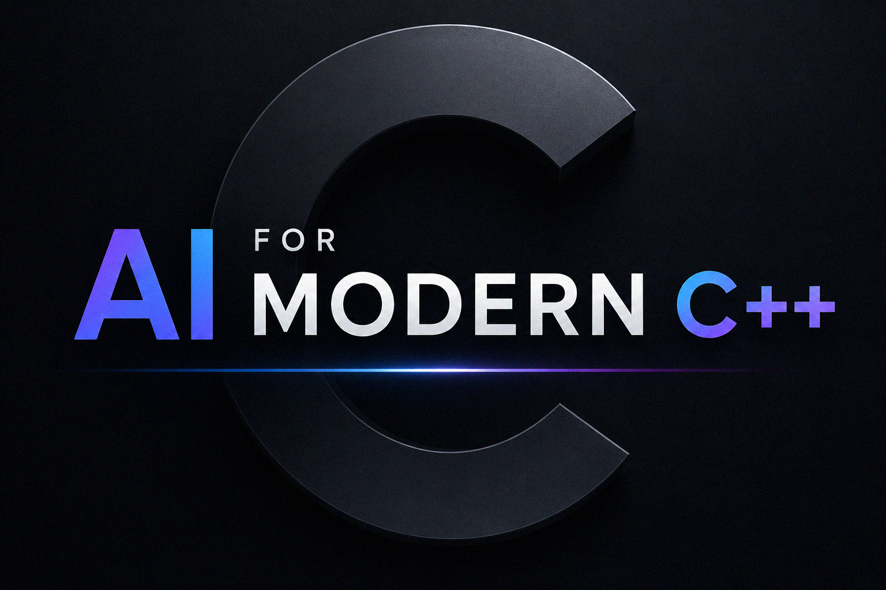
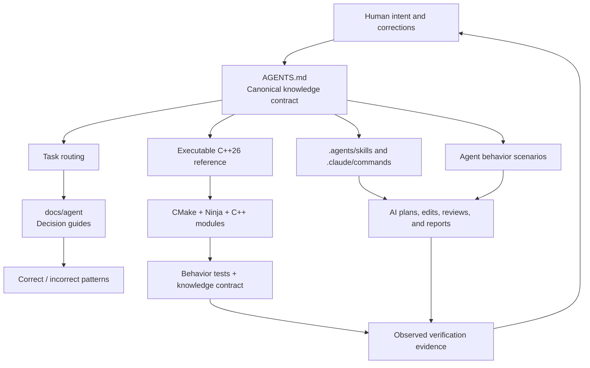

# AI for Modern C++

An executable knowledge base that teaches AI coding agents how to understand,
design, modify, verify, and review modern C++ repositories.

<p align="center"></p>

This repository combines five forms of knowledge:

1. **Rules** — stable, enforceable policy in `AGENTS.md`.
2. **Routing** — task-specific guides under `docs/agent/`.
3. **Patterns** — explicitly labeled correct and incorrect examples.
4. **Executable proof** — module-based C++26 source code that must build.
5. **Evals** — scenarios that test whether an AI agent applies the rules.

It is intentionally strict. The goal is not to collect isolated language
features or become an application product. The goal is to make high-quality
modern C++ engineering behavior legible and repeatable for AI agents.

## Knowledge Architecture



## How An Agent Uses The Repository

```text
Read AGENTS.md
    ↓
Classify the task
    ↓
Read the routed task guides
    ↓
Inspect code, tests, and the current diff
    ↓
Apply the smallest rule-compliant change
    ↓
Configure → build → test → review
    ↓
Report exact evidence
    ↓
Reflect durable human corrections back into the knowledge base
```

## Repository Map

```text
AGENTS.md                  Canonical policy and stable rule identifiers
CLAUDE.md                  Claude Code entry point
.agents/skills/            Codex-compatible repository workflows
.claude/commands/          Claude Code workflow adapters
docs/agent/                Task-specific engineering decision guides
docs/REVIEW.md             Rule-driven review checklist
docs/MCP.md                Safe tool and context policy
evals/                     Agent behavior scenarios and scoring rubric
src/                       Executable module-based proof of the rules
tests/                     Behavior tests and knowledge-contract checks
.github/workflows/ci.yml   macOS and Linux verification
CMakeLists.txt             Project-module and standard-header integration
```

Start with [`AGENTS.md`](AGENTS.md), then use the routing table in that file.
The detailed knowledge map is in
[`docs/agent/README.md`](docs/agent/README.md).

## Engineering Position

The reference implementation demonstrates and enforces:

- C++26 as the primary path, with modern C++20+ policy for derived work.
- C++ modules by default.
- Minimal standard-library headers in global module fragments; experimental
  `import std` is deliberately excluded while `.cppm` project modules remain
  mandatory.
- Declaration in `.cppm` and non-trivial implementation in `.cpp`.
- Dotted lowercase module identities and matching namespaces.
- PascalCase enum-class enumerators and `m_`-prefixed private members.
- A consistent modern syntax contract for initialization, casts, nullability,
  control flow, readable return declarations, and const correctness.
- `std::print` and `std::println` for ordinary formatted console output rather
  than legacy iostream insertion chains.
- Concepts and compile-time contracts where they improve correctness.
- Explicit recoverable errors with `std::expected`.
- RAII ownership and isolated platform boundaries.
- Target-based CMake, Ninja, real builds, and honest test evidence.
- Qt Quick/QML as the primary interface for new user-facing interactive
  applications when the surface is unspecified, with C++ module-based domain
  behavior and an explicit presentation boundary.
- Product-specific UI/UX decisions instead of generic repetitive screen
  recipes, with QML and presentation assets grouped under a top-level `ui/`
  boundary.
- Optional CLI adapters for automation, tests, or headless use share the same
  application and domain modules rather than duplicating behavior.
- Full-product verification: every requested surface must be enabled, built,
  tested, and smoke-checked before an archive is called ready. A passing core
  build never substitutes for an unbuilt Qt executable.
- No fake success reports and no unrelated broad rewrites.

## Interaction Surface Default

An unspecified user-facing interactive application is not a request for a
CLI-only program. Its primary interface uses Qt 6, Qt Quick, QML, and Qt Quick
Controls. A request explicitly scoped to a CLI tool, service, library, daemon,
or headless process remains non-graphical.

A CLI may be added as a secondary adapter when it provides real automation,
testing, or headless value. The Qt Quick interface and CLI must call the same
C++ application and domain modules; neither adapter owns duplicated business
logic.

## Qt Quick UI Workflow

For a new Qt interface, invoke the repository workflow with a concrete product
goal:

```text
$source-command-design-qt-quick-ui

Create a MyApp interface with keyboard input, accessible focus, responsive
layout, explicit loading and error states, and domain logic in C++ modules.
```

The workflow requires a user-flow and visual-system pass before implementation,
including audience, information hierarchy, affordances, feedback, recovery,
content density, and a product-specific visual direction. It uses Qt Quick/QML
rather than Qt Widgets for new UI, keeps QML and visual assets under `ui/`, and
verifies the C++/QML boundary. See
[`docs/agent/QT_QUICK_UI.md`](docs/agent/QT_QUICK_UI.md).

When QML uses responsibility-based subdirectories, generated projects select
QTP0004 through a minimum-version-compatible guard before QML module
registration. A missing `.qmltypes` file after an earlier failed CMake Generate
step is treated as a cascading symptom. Nested `QML_ELEMENT` adapter headers are
also added to the owning target's include path so generated registration code
can compile them by basename.

A QObject created from QML through `QML_ELEMENT` is not declared `final`,
because Qt generates a registration wrapper derived from it. Final delivery
uses a clean Qt-enabled build, compiles all generated QML/MOC/resource sources,
links the graphical executable, runs all tests, and exercises a deterministic
QML or GUI smoke flow. If Qt is unavailable, the GUI is reported as
`NOT VERIFIED`; the archive is not described as final.

The complete C++ syntax and identifier contract is documented in
[`docs/agent/SYNTAX_AND_STYLE.md`](docs/agent/SYNTAX_AND_STYLE.md).
The copy-ready CMake shape for generated Qt Quick projects is documented in
[`docs/agent/PROJECT_CMAKE_BASELINE.md`](docs/agent/PROJECT_CMAKE_BASELINE.md).

## Build The Executable Proof

The build has one deterministic architecture: project-owned C++ modules plus
minimal standard-library headers. It does not configure experimental standard
modules, metadata JSON files, UUID gates, or delivery-mode switches.

```bash
cmake -S . -B build -G Ninja -DCMAKE_BUILD_TYPE=Debug
cmake --build build --parallel
ctest --test-dir build --output-on-failure --no-tests=error
```

Expected configure evidence includes:

```text
AIMCPP_PROJECT_MODULES=ON
AIMCPP_STANDARD_LIBRARY=HEADERS
```

The build compiles `.cppm` interfaces through `FILE_SET CXX_MODULES`, consumers
import project modules, and standard headers remain in global module fragments.
No project-owned `.h` or `.hpp` fallback is created.

## Executable Reference Layout

```text
src/modern_cpp_agent/modern_cpp_agent.cppm   Exported declarations
src/modern_cpp_agent/modern_cpp_agent.cpp    Non-trivial implementation
src/main.cpp                                 Composition and usage example
tests/core_tests.cpp                         Public behavior verification
tests/knowledge_contract.cmake               Knowledge architecture regression test
```

The reference demonstrates `std::expected`, `std::optional`, `std::span`,
concepts, ranges, `constexpr`, `consteval`, `std::chrono`, `std::format`, and
`std::println` without turning the module interface into an implementation
dumping ground.

## Rule-Driven Review

Reviews cite stable identifiers rather than vague preferences:

```text
MOD-002: Exported declarations belong in .cppm.
ERR-001: Recoverable failures should use std::expected.
VER-003: Report exact commands and results.
```

Use [`docs/REVIEW.md`](docs/REVIEW.md) for the review contract and
[`evals/README.md`](evals/README.md) to evaluate agent behavior.

## Safe Tooling

The repository includes `.mcp.example.json` as a read-first starting point.
Local active configuration belongs in `.mcp.json` and must not contain committed
secrets. See [`docs/MCP.md`](docs/MCP.md).

## Portability Notes

- Project-owned modules use minimal standard headers in global module
  fragments on every toolchain.
- No standard-library module metadata or experimental CMake gate is required.
- Avoid `std::views::enumerate` in portable examples until the active standard
  library is verified to provide it.

## Linux GCC Build

GCC 15.x, packaged CMake 3.30/3.31, and Ninja can build the project modules
without standard-library module metadata. On Ubuntu 25.10:

```bash
sudo apt update
sudo apt install --yes cmake g++ ninja-build
bash scripts/verify-linux.sh
```

On Fedora 43:

```bash
sudo dnf install --assumeyes cmake gcc-c++ ninja-build
bash scripts/verify-linux.sh
```

## License

MIT
