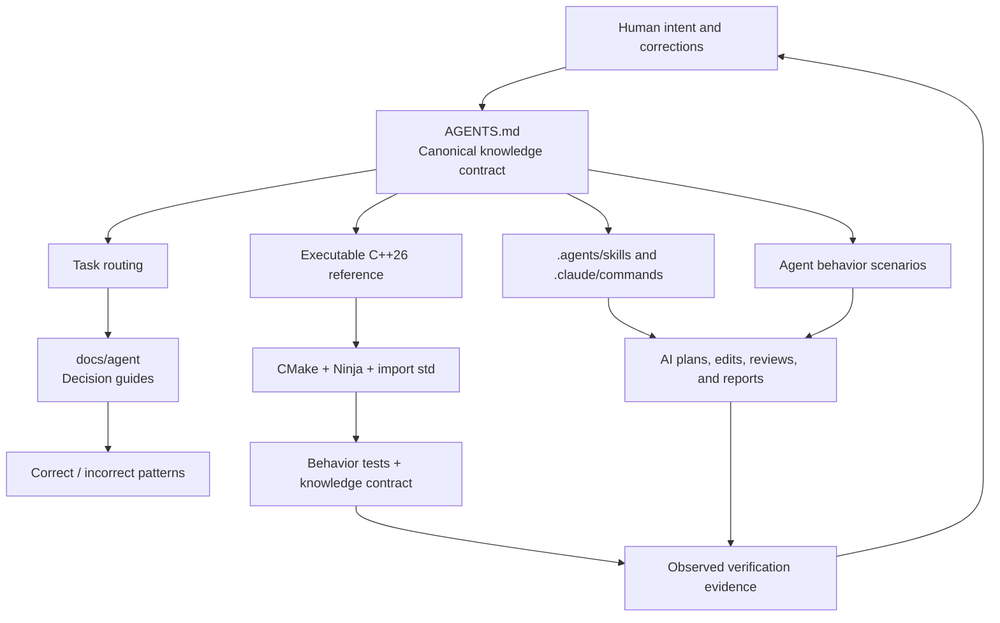

# AI for Modern C++

An executable knowledge base that teaches AI coding agents how to understand,
design, modify, verify, and review modern C++ repositories.

<p align="center"></p>

This repository combines five forms of knowledge:

1. **Rules** — stable, enforceable policy in `AGENTS.md`.
2. **Routing** — task-specific guides under `docs/agent/`.
3. **Patterns** — explicitly labeled correct and incorrect examples.
4. **Executable proof** — module-based C++26 source code that must build.
5. **Evals** — scenarios that test whether an AI agent applies the rules.

It is intentionally strict. The goal is not to collect isolated language
features or become an application product. The goal is to make high-quality
modern C++ engineering behavior legible and repeatable for AI agents.

## Knowledge Architecture



## How An Agent Uses The Repository

```text
Read AGENTS.md
    ↓
Classify the task
    ↓
Read the routed task guides
    ↓
Inspect code, tests, and the current diff
    ↓
Apply the smallest rule-compliant change
    ↓
Configure → build → test → review
    ↓
Report exact evidence
    ↓
Reflect durable human corrections back into the knowledge base
```

## Repository Map

```text
AGENTS.md                  Canonical policy and stable rule identifiers
CLAUDE.md                  Claude Code entry point
.agents/skills/            Codex-compatible repository workflows
.claude/commands/          Claude Code workflow adapters
docs/agent/                Task-specific engineering decision guides
docs/REVIEW.md             Rule-driven review checklist
docs/MCP.md                Safe tool and context policy
evals/                     Agent behavior scenarios and scoring rubric
src/                       Executable module-based proof of the rules
tests/                     Behavior tests and knowledge-contract checks
.github/workflows/ci.yml   macOS and Linux verification
CMakeLists.txt             Strict CMake and mandatory import std integration
```

Start with [`AGENTS.md`](AGENTS.md), then use the routing table in that file.
The detailed knowledge map is in
[`docs/agent/README.md`](docs/agent/README.md).

## Engineering Position

The reference implementation demonstrates and enforces:

- C++26 as the primary path, with modern C++20+ policy for derived work.
- C++ modules by default.
- Mandatory `import std` with no textual standard-library fallback.
- Declaration in `.cppm` and non-trivial implementation in `.cpp`.
- Dotted lowercase module identities and matching namespaces.
- Concepts and compile-time contracts where they improve correctness.
- Explicit recoverable errors with `std::expected`.
- RAII ownership and isolated platform boundaries.
- Target-based CMake, Ninja, real builds, and honest test evidence.
- No fake success reports and no unrelated broad rewrites.

## Build The Executable Proof

The active compiler, standard library, CMake version, generator, and standard
library module metadata must support `import std` together.

```bash
cmake -S . -B build -G Ninja -DCMAKE_BUILD_TYPE=Debug
cmake --build build --parallel
ctest --test-dir build --output-on-failure --no-tests=error
```

Expected configure evidence includes:

```text
AIMCPP_IMPORT_STD_REQUIRED=ON
CMAKE_CXX_COMPILER_IMPORT_STD=23;26
```

Unsupported combinations fail during configuration. They are not silently
downgraded to standard-library includes.

## Executable Reference Layout

```text
src/modern_cpp_agent/modern_cpp_agent.cppm   Exported declarations
src/modern_cpp_agent/modern_cpp_agent.cpp    Non-trivial implementation
src/main.cpp                                 Composition and usage example
tests/core_tests.cpp                         Public behavior verification
tests/knowledge_contract.cmake               Knowledge architecture regression test
```

The reference demonstrates `std::expected`, `std::optional`, `std::span`,
concepts, ranges, `constexpr`, `consteval`, `std::chrono`, `std::format`, and
`std::println` without turning the module interface into an implementation
dumping ground.

## Rule-Driven Review

Reviews cite stable identifiers rather than vague preferences:

```text
MOD-002: Exported declarations belong in .cppm.
ERR-001: Recoverable failures should use std::expected.
VER-003: Report exact commands and results.
```

Use [`docs/REVIEW.md`](docs/REVIEW.md) for the review contract and
[`evals/README.md`](evals/README.md) to evaluate agent behavior.

## Safe Tooling

The repository includes `.mcp.example.json` as a read-first starting point.
Local active configuration belongs in `.mcp.json` and must not contain committed
secrets. See [`docs/MCP.md`](docs/MCP.md).

## Portability Notes

- The primary compiler path is Clang 22+; GCC 15+ is supported only when the
  compiler, libstdc++, CMake, Ninja, and module metadata agree.
- Do not assume C compatibility globals are exported by `import std`.
- Avoid `std::views::enumerate` in portable examples until the active standard
  library is verified to provide it.

## License

MIT
