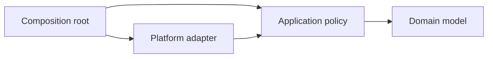
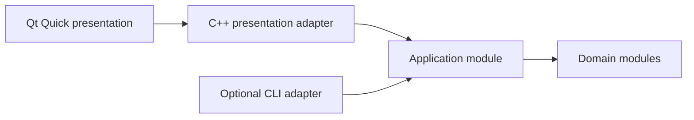

# Architecture Decisions For Agents

Use this guide when locating behavior, adding a subsystem, or changing
dependencies. Canonical rules: `ARC-*`, `MOD-*`, and `PLT-*` in `AGENTS.md`.

## First Question: Who Owns The Behavior?

Do not start by choosing a filename. Start by naming the responsibility.

| Responsibility | Typical owner |
|---|---|
| Domain invariant or value | Domain module |
| Application orchestration | Application module |
| Filesystem, network, process, or OS integration | Platform/adapter module |
| Dependency construction and process startup | Executable composition root |
| Product interaction-surface selection | Explicit request or the `GUI-015` default |
| Qt Quick layout, animation, and interaction | QML presentation layer |
| QML-facing properties, signals, and commands | C++ presentation adapter |
| Automation or headless command surface | Optional CLI adapter |
| Verification-only utilities | Test source, never exported production API |

If no owner is clear, the architecture is not understood well enough to edit.

## Dependency Direction

Stable concepts should not depend on volatile mechanisms.



Domain code must not import platform adapters. Platform adapters implement or
support needs defined by stable application/domain abstractions.

## Interaction Surfaces

For a user-facing interactive application whose interface is unspecified,
`GUI-015` selects Qt Quick as the primary surface. A CLI is optional and remains
an adapter rather than a second owner of application behavior.



Explicit CLI tools, services, libraries, daemons, and headless processes do not
gain a graphical dependency merely because Qt Quick is the interactive-product
default. Classify the product surface before choosing composition roots.

## Cohesive Repository Layout

Directory names should reveal ownership, not merely file technology. A
user-facing application may grow toward this shape when every listed
responsibility is present:

```text
src/
  domain/          Pure rules, values, and invariants
  application/     Use cases and authoritative state transitions
  presentation/    Typed adapters for UI-facing state and commands
  adapters/        Persistence, network, platform, and third-party boundaries
  bootstrap/       Composition roots and process startup
  cli/             Optional secondary command adapter
ui/
  Main.qml
  pages/
  components/
  theme/
  assets/
tests/
  domain/
  application/
  presentation/
  ui/
```

This is a responsibility map, not a request to create empty directories. A
small product may combine adjacent responsibilities until a real dependency,
contract, or testing pressure justifies separation. It must not collapse
unrelated behavior into `common/`, `helpers/`, a top-level `qml/` bucket, or a
large composition entry point merely to avoid naming the owner.

For Qt Quick projects, `ui/` is the visual boundary. QML remains the language
inside that boundary, while the directory name describes its architectural
role and leaves room for design tokens, fonts, images, and other presentation
assets.

## Module Boundary Test

A module boundary is justified when at least one is true:

- It owns a stable domain concept.
- It isolates a volatile dependency or platform.
- It has a distinct public contract and independent tests.
- It prevents implementation details from leaking across subsystems.

A boundary is suspicious when its only purpose is reducing file length or when
its name is `utils`, `helpers`, `common`, or `misc`.

## Adding A Subsystem

Before creating files, record:

```text
Responsibility:
Public contract:
Owned data and invariants:
Dependencies:
Expected failures:
Platform assumptions:
Tests proving the boundary:
```

Then choose a dotted domain-oriented module name and follow `MODULES.md`.

## Composition Root

`main.cpp` may construct concrete adapters and connect them to stable
application APIs. It should not contain domain algorithms, persistence logic,
or reusable business rules.

## Architectural Smells

- A public module importing an internal platform module.
- Several modules mutating the same global state.
- Cross-module access to private representation through helper functions.
- A module named after a technical grab bag rather than owned behavior.
- Tests requiring unrelated subsystems to validate one invariant.
- Exported APIs added only to make tests reach private implementation.

For Qt UI dependency direction and ownership, also read `QT_QUICK_UI.md`.

When a smell is observed, explain the dependency problem before proposing a
new abstraction.
