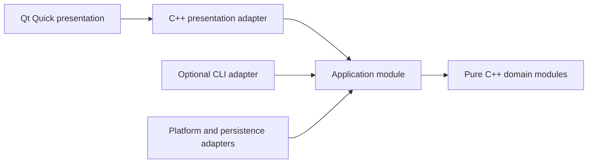

# Qt Quick UI Engineering

Use this guide for any new or modified Qt graphical interface. Canonical rules:
`GUI-*`, plus `ARC-*`, `NAM-*`, `SYN-*`, `RES-*`, and `TST-*`.

The default stack is Qt 6, Qt Quick, QML, and Qt Quick Controls. Qt Widgets is a
compatibility technology, not the default for new interfaces.

## Interaction Surface Selection

Classify the product surface before designing screens or targets:

| Request or inspected context | Primary surface |
|---|---|
| Explicit graphical, desktop, Qt, or QML application | Qt Quick |
| User-facing interactive application with no interface specified | Qt Quick |
| Explicit CLI tool, service, library, daemon, or headless process | Requested non-graphical surface |
| Existing compatible UI under a constrained change | Preserve it and document any `GUI-002` exception |

Do not silently interpret an unspecified user-facing interactive application as
CLI-only. Under `GUI-015`, Qt Quick is the primary interface. If automation,
testing, or headless use has real value, a CLI may be added as a secondary
adapter under `GUI-016`; it is not a substitute for the graphical interface.

Both adapters call the same C++ application and domain modules. QML and CLI
argument parsing must not contain duplicated domain decisions. When the request
is explicitly non-graphical, do not add Qt merely to follow a default that does
not apply.

## Required Design Pass

Do not begin with `Main.qml`. Define the interaction model first:

```text
Primary user goal:
Screens and navigation:
User actions:
Authoritative state:
Loading, empty, success, and failure states:
Keyboard path and focus order:
Reusable components:
Design tokens:
Responsive breakpoints or layout behavior:
Accessibility labels and announcements:
Localization requirements:
```

A visually attractive screen that omits failure, focus, resizing, or ownership
states is incomplete.

## Architecture



Dependency rules:

- Domain modules do not import Qt Quick, QML, or visual types.
- Application modules own use cases and authoritative behavior.
- A presentation adapter translates typed C++ state into a minimal QML-facing
  contract.
- QML owns layout, transitions, visual state, and input forwarding.
- The composition root creates concrete dependencies and registers UI types.

## QML And C++ Responsibility Matrix

| Responsibility | Owner |
|---|---|
| Domain decisions, validation, business rules | C++ domain module |
| Use-case orchestration and authoritative state | C++ application module |
| QML properties, signals, commands, list models | C++ presentation adapter |
| Layout, controls, animation, visual feedback | QML |
| Filesystem, network, settings, OS APIs | C++ adapter/platform module |

Small QML expressions for visibility, formatting, and visual state are
acceptable. Parsing, persistence, validation, and domain decisions are not.

## Generic Reference Layout

```text
src/
  app/
    app.cppm
    app.cpp
  presentation/
    app_view_model.hpp
    app_view_model.cpp
  bootstrap/
    main.cpp
  cli/
    main.cpp  # optional secondary adapter
qml/
  Main.qml
  components/
    PrimaryActionButton.qml
    StatusPanel.qml
tests/
  app_tests.cpp
  app_view_model_tests.cpp
  qml/
    tst_AppShell.qml
```

The `.hpp` presentation file is permitted only when Qt MOC requires a textual
meta-object boundary. It is an external-tool adapter under `MOD-007`, not a
reason to replace domain modules with headers.

## Presentation Contract

Expose the smallest contract QML needs:

- typed `Q_PROPERTY` state with `NOTIFY` or bindable semantics;
- clearly named invokable user intents;
- signals for observable events, not hidden command channels;
- `QAbstractItemModel` derivatives for structured collections;
- immutable value snapshots where practical;
- explicit busy, error, empty, and disabled states.

Do not expose a large service object or raw domain graph to QML.

## Optional CLI Adapter

When an additional CLI is justified, keep it as a thin composition and
input/output adapter:

```cmake
add_executable(MyAppCli src/cli/main.cpp)
target_link_libraries(MyAppCli PRIVATE app_core)
target_compile_features(MyAppCli PRIVATE cxx_std_26)
```

The CLI forwards user intent to `app_core`; it does not reimplement validation,
state transitions, persistence policy, or other authoritative behavior.

## QML Naming And Component Structure

- QML component files and exported QML types use PascalCase.
- `id`, property, signal, handler, and function names use lowerCamelCase.
- Reusable components describe a UI role: `PrimaryActionButton`, not
  `BlueButton`.
- Keep pages responsible for composition; move reusable visuals into focused
  components.
- Avoid giant `Main.qml` files that own the whole product.

## Layout And Visual System

- Prefer `RowLayout`, `ColumnLayout`, `GridLayout`, anchors, and implicit sizes
  over absolute coordinates.
- Define reusable spacing, radius, typography, color, and motion tokens.
- Support light/dark appearance through tokens rather than scattered colors.
- Preserve readable content under resizing and text expansion.
- Use animation to explain state changes, not delay interaction.
- Avoid magic pixels repeated across components.

## Accessibility And Input

Every interactive flow must be usable without a mouse:

- deliberate tab/focus order;
- visible focus indicators;
- keyboard activation and shortcuts where appropriate;
- accessible names, descriptions, roles, and state;
- adequate contrast and target size;
- no color-only communication;
- screen-reader announcement for important result or error changes.

## Localization And Text

User-visible strings must be translation-ready. Layouts must tolerate longer
translations, different number formats, and right-to-left presentation when the
product scope requires it. Do not concatenate translated sentence fragments.

## Responsiveness And Performance

- Never block the GUI thread with I/O or expensive computation.
- Model asynchronous progress, cancellation, failure, and object lifetime.
- Avoid bindings that form loops or repeatedly perform expensive work.
- Load large or optional UI regions deliberately.
- Test representative minimum, normal, and expanded window sizes.

## CMake Shape

```cmake
find_package(Qt6 REQUIRED COMPONENTS Quick Qml QuickControls2 Test)

qt_add_executable(MyApp
    src/bootstrap/main.cpp
    src/presentation/app_view_model.cpp
    src/presentation/app_view_model.hpp
)

qt_add_qml_module(MyApp
    URI MyApp
    VERSION 1.0
    QML_FILES
        qml/Main.qml
        qml/components/PrimaryActionButton.qml
        qml/components/StatusPanel.qml
)

target_link_libraries(MyApp
    PRIVATE
        app_core
        Qt6::Quick
        Qt6::Qml
        Qt6::QuickControls2
)
```

Do not link `Qt6::Widgets` unless `GUI-002` has a documented exception.

## Verification

At minimum verify:

1. Pure C++ domain behavior, invalid input, and boundary values.
2. Presentation adapter state transitions and signals.
3. QML component creation and primary interactions.
4. Keyboard-only primary flow and focus visibility.
5. Resizing, long translations, empty/error/loading states, and theme contrast.
6. QML lint or equivalent project-provided static checks.
7. Configure, build, CTest, and relevant QML test runner results separately.
8. When a CLI adapter exists, verify it calls the shared application/domain
   behavior and does not replace graphical interaction coverage.

## Forbidden Shapes

- Choosing `QWidget` because the request merely says "Qt".
- Delivering only a CLI for an unspecified user-facing interactive application.
- Duplicating application or domain behavior between QML and a CLI adapter.
- Implementing domain decisions or validation in button-handler JavaScript.
- Registering a global mutable service object for convenient QML access.
- Hard-coding every position and size for one screenshot.
- Blocking the GUI thread during file, network, or expensive domain work.
- Linking all Qt modules rather than the required target-local components.
- Claiming a polished interface without keyboard and accessibility verification.
