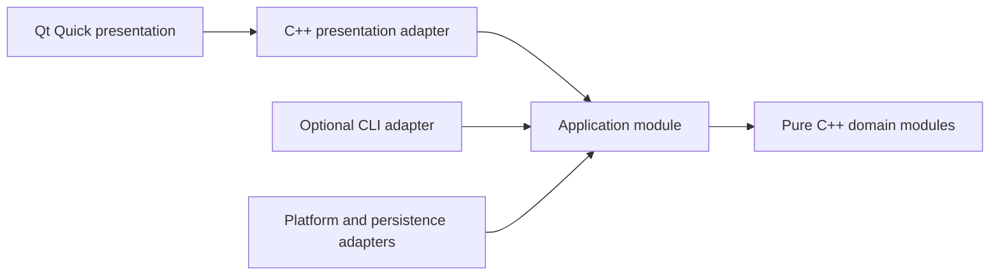

# Qt Quick UI Engineering

Use this guide for any new or modified Qt graphical interface. Canonical rules:
`GUI-*`, plus `ARC-*`, `NAM-*`, `SYN-*`, `RES-*`, and `TST-*`.

Generated projects should begin with the combined ordering in
[`PROJECT_CMAKE_BASELINE.md`](PROJECT_CMAKE_BASELINE.md), which keeps project
modules, Qt policy setup, and generated-type include paths aligned.

The default stack is Qt 6, Qt Quick, QML, and Qt Quick Controls. Qt Widgets is a
compatibility technology, not the default for new interfaces.

## Interaction Surface Selection

Classify the product surface before designing screens or targets:

| Request or inspected context | Primary surface |
|---|---|
| Explicit graphical, desktop, Qt, or QML application | Qt Quick |
| User-facing interactive application with no interface specified | Qt Quick |
| Explicit CLI tool, service, library, daemon, or headless process | Requested non-graphical surface |
| Existing compatible UI under a constrained change | Preserve it and document any `GUI-002` exception |

Do not silently interpret an unspecified user-facing interactive application as
CLI-only. Under `GUI-015`, Qt Quick is the primary interface. If automation,
testing, or headless use has real value, a CLI may be added as a secondary
adapter under `GUI-016`; it is not a substitute for the graphical interface.

Both adapters call the same C++ application and domain modules. QML and CLI
argument parsing must not contain duplicated domain decisions. When the request
is explicitly non-graphical, do not add Qt merely to follow a default that does
not apply.

## Required Design Pass

Do not begin with `Main.qml`. Define the interaction model first:

```text
Audience and usage context:
Primary user goal:
Product-specific visual direction:
Information hierarchy and content density:
Screens and navigation:
User actions:
Authoritative state:
Loading, empty, success, and failure states:
Affordances, immediate feedback, and error prevention/recovery:
Keyboard path and focus order:
Reusable components:
Design tokens:
Responsive breakpoints or layout behavior:
Accessibility labels and announcements:
Localization requirements:
```

A visually attractive screen that omits failure, focus, resizing, or ownership
states is incomplete.

## Product-Specific UI/UX Direction

Consistency is not repetition. Tokens and reusable components should make the
product coherent, but every screen composition must follow its task and
information hierarchy. Before drawing components, explain:

- who uses the product, in which environment, and what they need to notice
  first;
- which action is primary, which actions are secondary, and which actions are
  destructive or reversible;
- how the interface makes system status, selection, progress, validation, and
  recovery visible without requiring recall;
- how progressive disclosure controls complexity and preserves an appropriate
  content density;
- which visual qualities make the product recognizable without weakening
  usability or accessibility.

Do not default every product to the same centered hero, rounded-card grid,
gratuitous gradient, glass panel, oversized empty spacing, or dashboard shell.
Do not copy a reference screenshot as a component recipe. Extract useful
interaction principles, then adapt hierarchy, density, typography, motion, and
component composition to the actual product.

Use established UX principles deliberately: recognition over recall, visible
system status, clear affordances, immediate feedback, error prevention,
actionable recovery, consistent terminology, keyboard efficiency, and
accessible contrast. A distinctive visual direction is successful only when
the main task becomes easier to understand and complete.

## Architecture



Dependency rules:

- Domain modules do not import Qt Quick, QML, or visual types.
- Application modules own use cases and authoritative behavior.
- A presentation adapter translates typed C++ state into a minimal QML-facing
  contract.
- QML owns layout, transitions, visual state, and input forwarding.
- The composition root creates concrete dependencies and registers UI types.

## QML And C++ Responsibility Matrix

| Responsibility | Owner |
|---|---|
| Domain decisions, validation, business rules | C++ domain module |
| Use-case orchestration and authoritative state | C++ application module |
| QML properties, signals, commands, list models | C++ presentation adapter |
| Layout, controls, animation, visual feedback | QML |
| Filesystem, network, settings, OS APIs | C++ adapter/platform module |

Small QML expressions for visibility, formatting, and visual state are
acceptable. Parsing, persistence, validation, and domain decisions are not.

## Responsibility-Oriented Reference Layout

```text
src/
  domain/
    app_domain.cppm
    app_domain.cpp
  application/
    app.cppm
    app.cpp
  presentation/
    app_view_model.hpp
    app_view_model.cpp
  adapters/
  bootstrap/
    main.cpp
  cli/
    main.cpp  # optional secondary adapter
ui/
  Main.qml
  pages/
  components/
    PrimaryActionButton.qml
    StatusPanel.qml
  theme/
    Theme.qml
  assets/
tests/
  domain/
  application/
  presentation/
  ui/
    tst_AppShell.qml
```

Create only directories that own real behavior or assets. The structure may be
smaller for a small product, but a new Qt Quick project uses `ui/` as its visual
boundary rather than a top-level `qml/` technology bucket. `pages/`,
`components/`, `theme/`, and `assets/` are responsibility-based subdivisions,
not mandatory empty ceremony.

The `.hpp` presentation file is permitted only when Qt MOC requires a textual
meta-object boundary. It is an external-tool adapter under `MOD-007`, not a
reason to replace domain modules with headers.

## Presentation Contract

Expose the smallest contract QML needs:

- typed `Q_PROPERTY` state with `NOTIFY` or bindable semantics;
- clearly named invokable user intents;
- signals for observable events, not hidden command channels;
- `QAbstractItemModel` derivatives for structured collections;
- immutable value snapshots where practical;
- explicit busy, error, empty, and disabled states.

Do not expose a large service object or raw domain graph to QML.

### Creatable Types And `final`

`QML_ELEMENT` makes a class creatable from QML unless another registration
policy says otherwise. Qt generates an internal wrapper derived from that C++
type. Therefore a type instantiated like this:

```qml
AppViewModel {
    id: appViewModel
}
```

must not be declared `final`:

```cpp
class AppViewModel : public QObject {
    Q_OBJECT
    QML_ELEMENT
};
```

This is a framework extension point, not an invitation for project code to
subclass the adapter. A presentation type may remain `final` only when QML does
not instantiate it and the selected singleton, uncreatable, context-property,
or factory ownership strategy has been verified not to require Qt-generated
subclassing.

## Optional CLI Adapter

When an additional CLI is justified, keep it as a thin composition and
input/output adapter:

```cmake
add_executable(MyAppCli src/cli/main.cpp)
target_link_libraries(MyAppCli PRIVATE app_core)
target_compile_features(MyAppCli PRIVATE cxx_std_26)
```

The CLI forwards user intent to `app_core`; it does not reimplement validation,
state transitions, persistence policy, or other authoritative behavior.

## QML Naming And Component Structure

- Keep QML, visual tokens, and presentation assets under the top-level `ui/`
  boundary for new repositories.
- QML component files and exported QML types use PascalCase.
- `id`, property, signal, handler, and function names use lowerCamelCase.
- Reusable components describe a UI role: `PrimaryActionButton`, not
  `BlueButton`.
- Keep pages responsible for composition; move reusable visuals into focused
  components.
- Avoid giant `Main.qml` files that own the whole product.

## Layout And Visual System

- Prefer `RowLayout`, `ColumnLayout`, `GridLayout`, anchors, and implicit sizes
  over absolute coordinates.
- Define reusable spacing, radius, typography, color, and motion tokens.
- Let task hierarchy and content density determine composition; do not place
  every piece of content in an identical card merely for visual consistency.
- Support light/dark appearance through tokens rather than scattered colors.
- Preserve readable content under resizing and text expansion.
- Use animation to explain state changes, not delay interaction.
- Avoid magic pixels repeated across components.

## Accessibility And Input

Every interactive flow must be usable without a mouse:

- deliberate tab/focus order;
- visible focus indicators;
- keyboard activation and shortcuts where appropriate;
- accessible names, descriptions, roles, and state;
- adequate contrast and target size;
- no color-only communication;
- screen-reader announcement for important result or error changes.

## Localization And Text

User-visible strings must be translation-ready. Layouts must tolerate longer
translations, different number formats, and right-to-left presentation when the
product scope requires it. Do not concatenate translated sentence fragments.

## Responsiveness And Performance

- Never block the GUI thread with I/O or expensive computation.
- Model asynchronous progress, cancellation, failure, and object lifetime.
- Avoid bindings that form loops or repeatedly perform expensive work.
- Load large or optional UI regions deliberately.
- Test representative minimum, normal, and expanded window sizes.

## CMake Shape

```cmake
find_package(Qt6 REQUIRED COMPONENTS Quick Qml QuickControls2 Test)

if(QT_KNOWN_POLICY_QTP0004)
    qt_policy(SET QTP0004 NEW)
endif()

qt_add_executable(MyApp
    src/bootstrap/main.cpp
)

qt_add_qml_module(MyApp
    URI MyApp
    VERSION 1.0
    QML_FILES
        ui/Main.qml
        ui/pages/HomePage.qml
        ui/components/PrimaryActionButton.qml
        ui/components/StatusPanel.qml
        ui/theme/Theme.qml
    SOURCES
        src/presentation/app_view_model.cpp
        src/presentation/app_view_model.hpp
)

target_include_directories(MyApp
    PRIVATE
        "${CMAKE_CURRENT_SOURCE_DIR}/src/presentation"
)

target_link_libraries(MyApp
    PRIVATE
        app_core
        Qt6::Quick
        Qt6::Qml
        Qt6::QuickControls2
)
```

Set guarded Qt policies after `find_package(Qt6 ...)` and before
`qt_add_qml_module`. `QTP0004` requires `qmldir` metadata for extra QML
directories; guarding it with `QT_KNOWN_POLICY_QTP0004` preserves compatibility
when the project's declared minimum Qt predates that policy. Do not claim a
higher Qt minimum merely to silence the warning.

QML type metadata such as `MyApp.qmltypes` is generated during a successful
CMake Generate/build workflow. If generation first fails for an unrelated
toolchain property, a missing `.qmltypes` diagnostic from the IDE is a
cascading symptom. Fix the first CMake failure, clear the stale CMake
configuration, and regenerate before diagnosing QML registration.

Qt-generated QML registration code may include a `QML_ELEMENT` adapter header
by basename. When that header lives under `src/presentation/`, add the directory
to the QML target with `target_include_directories`. Register the adapter under
the `SOURCES` section of `qt_add_qml_module`, keep the include path target-local,
and never edit the generated `*_qmltyperegistrations.cpp` file.

Do not link `Qt6::Widgets` unless `GUI-002` has a documented exception.

## Verification

At minimum verify:

1. Pure C++ domain behavior, invalid input, and boundary values.
2. Presentation adapter state transitions and signals.
3. QML component creation and primary interactions.
4. Keyboard-only primary flow and focus visibility.
5. Resizing, long translations, empty/error/loading states, and theme contrast.
6. QML lint or equivalent project-provided static checks.
7. Configure, build, CTest, and relevant QML test runner results separately.
8. When a CLI adapter exists, verify it calls the shared application/domain
   behavior and does not replace graphical interaction coverage.
9. Inspect the main flow at representative window sizes and confirm that the
   product-specific hierarchy, affordances, feedback, and recovery behavior are
   clear rather than merely visually consistent.
10. Configure a clean build with the GUI enabled, build the full default target,
    and confirm that MOC, QML type registration, resources, QML cache sources,
    and the graphical executable all compile and link.
11. Run a deterministic QML creation/interaction or GUI startup smoke check.
    Core-only tests do not validate the graphical product.

If Qt or another required GUI dependency is unavailable, report the Qt surface
as `NOT VERIFIED`. Do not describe the application or downloadable archive as
ready until the Qt-enabled build and smoke evidence exist.

## Forbidden Shapes

- Choosing `QWidget` because the request merely says "Qt".
- Delivering only a CLI for an unspecified user-facing interactive application.
- Duplicating application or domain behavior between QML and a CLI adapter.
- Implementing domain decisions or validation in button-handler JavaScript.
- Registering a global mutable service object for convenient QML access.
- Hard-coding every position and size for one screenshot.
- Reusing a generic card/gradient/dashboard recipe without a product-specific
  UX rationale.
- Copying a reference design without adapting hierarchy and interaction to the
  product.
- Creating a top-level `qml/` dumping directory in a new repository instead of
  an explicit `ui/` boundary.
- Ignoring QTP0004 for QML files in extra directories or requiring a newer Qt
  release solely to avoid a guarded policy check.
- Diagnosing a missing generated `.qmltypes` file before fixing an earlier
  failed CMake Generate step.
- Omitting the target-local include directory for a nested `QML_ELEMENT` header
  or editing generated QML type registration source to compensate.
- Declaring a QML-creatable `QML_ELEMENT` QObject `final` even though Qt's
  generated registration wrapper must derive from it.
- Claiming GUI completion from a core-only, GUI-disabled, or headless test build.
- Delivering a final archive when the requested Qt target or QML smoke flow was
  not verified in an environment with Qt installed.
- Blocking the GUI thread during file, network, or expensive domain work.
- Linking all Qt modules rather than the required target-local components.
- Claiming a polished interface without keyboard and accessibility verification.
